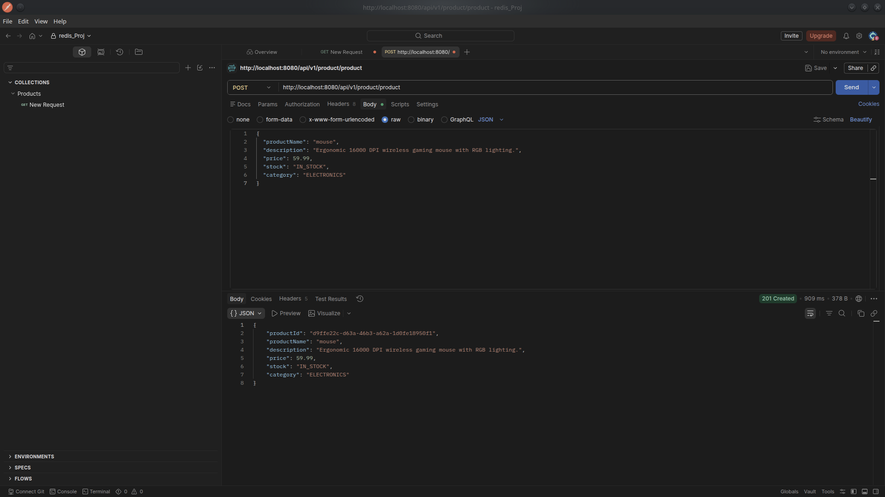
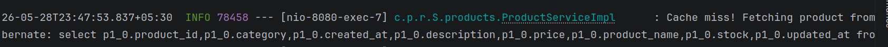
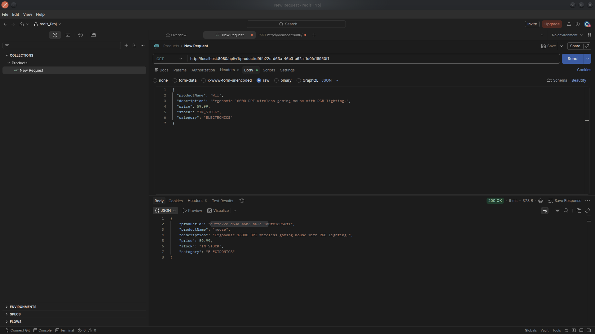

# Spring Boot Redis Caching

A RESTful API implementation demonstrating advanced Redis caching strategies using Spring Boot, PostgreSQL, and Java Records. 

This repository serves as a reference for handling serialization edge cases when migrating to **Spring Data Redis 4.x** and **Jackson 3**, specifically addressing polymorphic type validation and the deserialization of immutable Java `record` classes.

## Architecture & Implementation Details

* **Service-Layer Caching:** `@Cacheable` annotations are applied strictly at the Service layer to prevent caching of HTTP-specific wrappers (e.g., `ResponseEntity`). This isolation avoids `ClassCastException` failures during deserialization.
* **Java Record Serialization:** Configured Jackson 3 to correctly serialize and deserialize immutable Java `record` DTOs by enforcing explicit polymorphic typing (`DefaultTyping.EVERYTHING`).
* **Persistence:** PostgreSQL serves as the primary data store.

## Performance Benchmarks

The following Postman tests demonstrate the latency reduction achieved via the Redis caching layer.

### 1. Resource Creation (POST)
Initial database population generating the UUID.


### 2. Cache Miss (Initial GET)
The initial request queries PostgreSQL, retrieves the record, and populates the Redis cache.
* **Latency:** 581 ms


### 3. showing cache miss



### 4. Cache Hit (Subsequent GET)
Subsequent requests are served directly from memory via Redis, bypassing the database entirely.
* **Latency:** 9 ms



## Jackson Configuration Notes

By default, Jackson 3 ignores `final` classes (including Java `record` types) when applying polymorphic typing. To resolve `LinkedHashMap` deserialization errors when retrieving data from Redis, the custom `RedisCacheConfiguration` applies the following:

1. **Polymorphic Validator:** Whitelists the `com.project.redis_project` package to prevent arbitrary class instantiation vulnerabilities.
2. **Default Typing:** Enforces `DefaultTyping.EVERYTHING` to ensure Jackson writes the `@class` property into the JSON payload for records, allowing seamless reconstruction from the cache.

## Local Development Setup

### Prerequisites
* Java 17+
* Maven
* PostgreSQL (Running on `localhost:5432`)
* Redis (Running on `localhost:6379`)

### Starting Redis via Docker
If a local Redis server is not installed, it can be spun up using Docker:
```bash
docker run -d --name redis-server -p 6379:6379 redis:latest
